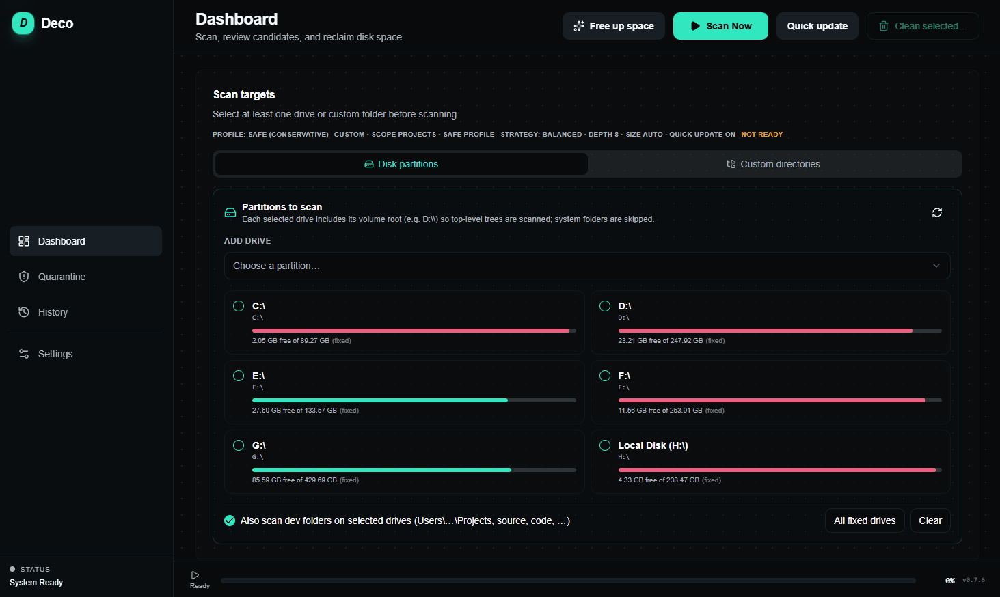
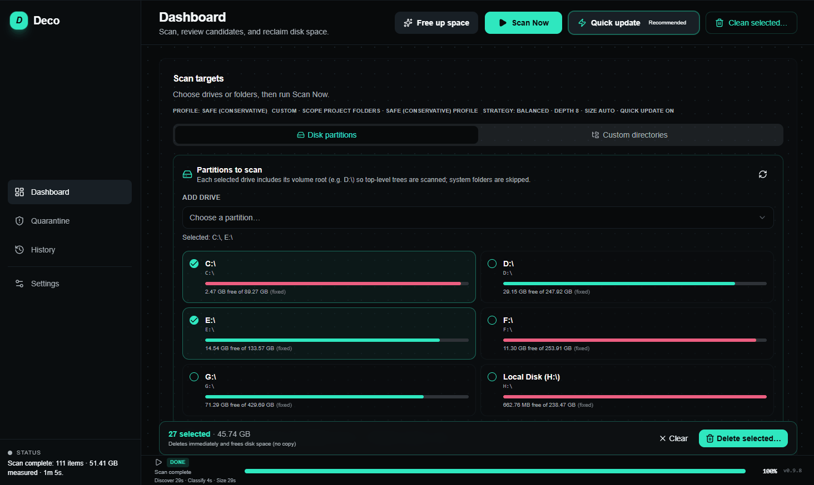
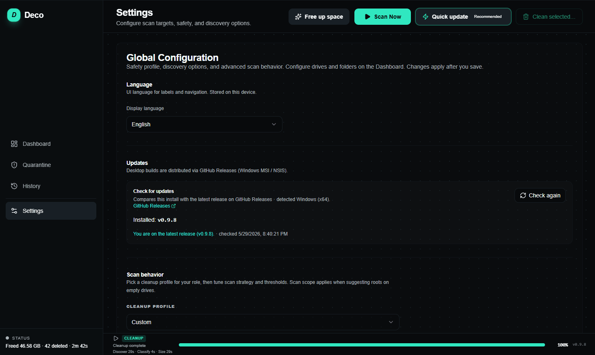

# Deco (Developer Compact)

Deco is a **desktop-first** cleanup app for developer machines, with a **CLI** for automation. Both use a **native Rust** engine in the desktop app and a parallel TypeScript implementation in the CLI today—see `ROADMAP.md` Milestone 2 for long-term contract alignment.

Goals: **safe defaults** (scan → review → quarantine-first cleanup → restore/purge), **low learning curve**, and **broad dev-artifact** coverage—not a general-purpose “every file” browser.

**v0.8.5 (Windows):** Optional **NTFS USN journal probe** in Settings → Experimental adds informational scan warnings on drive-letter volumes; candidate discovery remains a full directory walk ([details](docs/experiments/windows-ntfs-usn-inventory.md)).

## Demo

| Scan | Cleanup | Settings |
|------|---------|----------|
|  |  |  |

Full walkthrough: [user guide](docs/desktop/user-guide.md). To refresh recordings (flows, window size, compression): [readme-demos.md](docs/development/readme-demos.md).

Recorded on Windows (SSD). Cleanup throughput depends on disk, tree size, and how many `node_modules` / build folders are selected—see [batch delete](docs/experiments/batch-delete.md).

## Privacy & security

Deco is built for developers who need to trust what runs on their machine:

- **Local-first** — scanning, classification, preview, quarantine, and cleanup run on your PC. File paths and sizes stay on disk; the engine does not upload your tree, file names, or scan results to any server.
- **Offline by default** — normal use does not require a network connection. The only optional online step is **Check for updates** in Settings, which you trigger manually; it reads public GitHub Release metadata to compare versions and open download links.
- **Open and auditable** — source is available in this repository. There are no hidden scripts, telemetry bundles, or bundled third-party “phone home” components in the desktop installer or CLI package.
- **Safety-first deletes** — quarantine-first defaults, blocked system paths, and review-tier confirmations; see [Safety model](docs/product/safety.md) and [PROJECT.md](PROJECT.md).

If you find a security issue, please report it via a [private security advisory](https://github.com/Dendro-X0/Deco/security/advisories/new) on GitHub. See [SECURITY.md](SECURITY.md) for supported versions and the full disclosure process.

## Repository layout

| Path | Role |
|------|------|
| `apps/cli` | Node/TypeScript CLI (`deco` binary via `dist/cli.js`) |
| `apps/desktop` | Tauri shell + Rust backend |
| `apps/frontend` | Vite + React UI served to the WebView |
| `docs/` | [Documentation encyclopedia](docs/README.md) (getting started, product, CLI, distribution, milestones) |

## Quick start (Milestone 0 baseline)

Prerequisites: **Node 20+**, **pnpm**, **Rust** (for desktop/tests), **WebView2** on Windows for the desktop UI.

```bash
pnpm install
pnpm test:all    # CLI (Vitest) + Rust engine (cargo test)
```

### CLI

```bash
pnpm build:cli
pnpm dev:cli -- --dry-run --root . --max-depth 4 --no-size
```

Scan only (default dry-run in non-interactive mode): omit `--delete`. Deletion requires **`--delete --yes`**.

### Desktop (development)

Uses the Tauri CLI from npm (`pnpm -F @dendro-x0/deco-desktop tauri`). Frontend dev server: **`http://localhost:5173`** (configured in `apps/desktop/src-tauri/tauri.conf.json`).

```bash
pnpm dev:desktop
```

### Desktop (release installer)

```bash
pnpm build:desktop
```

Artifacts (typical): `apps/desktop/src-tauri/target/release/bundle/msi/`, `nsis/`.

### Rust tests (engine + commands)

```bash
cd apps/desktop/src-tauri && cargo test
```

## Distribution

Install from **GitHub Releases** (tag `v*`): desktop installers for **Windows, macOS, and Linux** plus per-OS CLI zips. No npm token required for end users.

| Artifact | Use |
|----------|-----|
| `.msi` / NSIS `.exe` | Desktop (Windows) |
| `.dmg` | Desktop (macOS, aarch64 from CI) |
| `.deb` / `.AppImage` | Desktop (Linux) |
| `deco-cli-*-*.zip` | Portable CLI (`deco.cmd` / `./deco`; requires Node 20+) |

Full guide: [`docs/distribution/github-releases.md`](docs/distribution/github-releases.md) · Install: [`docs/getting-started/install.md`](docs/getting-started/install.md)

## Documentation

**[docs/README.md](docs/README.md)** — navigation hub (encyclopedia)

| Category | Entry |
|----------|--------|
| Getting started | [Overview](docs/getting-started/overview.md) · [Install](docs/getting-started/install.md) · [Quickstart](docs/getting-started/quickstart.md) |
| Product | [Features](docs/product/features.md) · [Status](docs/product/status.md) · [Safety](docs/product/safety.md) |
| Desktop / CLI | [User guide](docs/desktop/user-guide.md) · [CLI usage](docs/cli/usage.md) |
| Distribution | [GitHub Releases](docs/distribution/github-releases.md) · [Release process](docs/distribution/release-process.md) |
| Contract | [Scan contract](docs/contract/scan-contract.md) · [Changelog](docs/contract/changelog.md) |
| Development | [Contributing](docs/development/contributing.md) · [CI](docs/development/ci-and-testing.md) |
| Milestones M0–M8 | [Index](docs/milestones/README.md) |

Also: [`PROJECT.md`](PROJECT.md) · [`ROADMAP.md`](ROADMAP.md) · [`CHANGELOG.md`](CHANGELOG.md)

## CI

- Pull requests / `main`: [`.github/workflows/ci.yml`](.github/workflows/ci.yml) (`pnpm test:all`).
- Tagged releases: [`.github/workflows/release.yml`](.github/workflows/release.yml).
