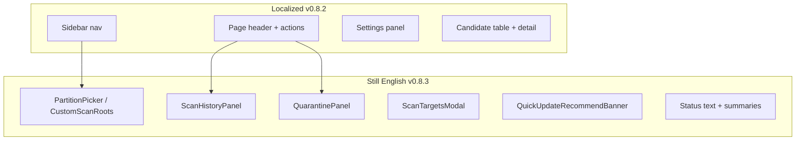

# Localization backlog & UX polish

Living inventory of **remaining English strings**, **mixed-locale surfaces**, and **UI/UX improvements**. Most v0.8.3 panel work is **shipped** — see [localization.md](localization.md) and [v0.8.3-manifest.md](../product/v0.8.3-manifest.md).

**Shipped in v0.8.2:** shell nav, Settings, dashboard candidate list/detail, planner.  
**Shipped in v0.8.3:** History, Quarantine, scan targets, wizard/onboarding, runtime status, confirm dialogs, cleanup toasts, cleanup statistics card.

---

## Mixed-locale pattern

When the UI language is Spanish, users still see English inside nested panels because those components were not wired to `useI18n()`. Profile/strategy **summary chips** on the dashboard are built in TypeScript (`cleanupProfileSummary`, `scanStrategySummary`) and also stay English.

---

## Remaining localization (by area)

### Dashboard — scan targets (high visibility)

| String (en) | Component | Suggested key prefix |
|-------------|-----------|----------------------|
| Partitions to scan, ADD DRIVE, Choose a partition… | `PartitionPicker.tsx` | `dashboard.partition.*` |
| Also scan dev folders on selected drives… | `PartitionPicker.tsx` | `dashboard.partition.devFolders` |
| All fixed drives, Clear | `PartitionPicker.tsx` | `dashboard.partition.*` |
| Custom directories flow | `CustomScanRoots.tsx` | `dashboard.customRoots.*` |
| CUSTOM · scope projects · SAFE PROFILE… | `cleanup-profiles.ts` / `scan-strategy.ts` summaries | `dashboard.summary.*` or locale-aware formatters |
| Use Quick update for your next scan… | `QuickUpdateRecommendBanner.tsx` | `dashboard.quickUpdateBanner.*` |
| Scan statistics labels | `ScanStatisticsCard.tsx` | `dashboard.scanStats.*` |
| Workspace summary | `WorkspaceRollupsCard.tsx` | `dashboard.workspace.*` |

### Modals & flows

| String (en) | Component | Suggested key prefix |
|-------------|-----------|----------------------|
| Choose scan targets, Start scan, scanning mode cards | `ScanTargetsModal.tsx`, `ScanModeSelector.tsx` | `modal.scanTargets.*` |
| Cleanup wizard steps | `CleanupWizard.tsx` | `wizard.*` |
| Onboarding steps | `OnboardingDialog.tsx` | `onboarding.*` |
| Confirm dialogs (delete history, purge quarantine, …) | `ConfirmDialog` callers | `common.confirm.*` |

### History tab (entire panel English)

| String (en) | Component |
|-------------|-----------|
| Scan History, Clear all, filters, Reuse Config, Delete | `ScanHistoryPanel.tsx` |

Suggested keys: `history.*` (mirror structure of `dashboard.filters.*` where possible).

### Quarantine tab (entire panel English)

| String (en) | Component |
|-------------|-----------|
| Quarantine, Refresh, Export log, Purge eligible, filters, empty state, Go to Dashboard | `QuarantinePanel.tsx` |

Suggested keys: `quarantine.*`.

### Global chrome & runtime messages

| String (en) | Source |
|-------------|--------|
| System Ready, Scan started, Quick update started | `use-deco.ts` |
| Ready | `scan-progress.ts`, footer |
| ESTADO + English status (sidebar shows label localized, value not) | `status.label` vs `status.text` |

Wire status strings through `t()` or a small `setStatusKey()` API so the sidebar and footer stay in sync.

### Dynamic / backend content (lower priority)

| Content | Notes |
|---------|--------|
| Policy pack example `label` / `description` from repo | Keep English or add optional manifest fields later |
| `quarantineStorageSummary()` | Move format string into JSON with placeholders |
| Risk/kind enum values in table (`safe`, `review`) | Optional: translate display labels, keep wire keys English |
| Date/time (`toLocaleString()`) | Use `locale` from `useI18n()` → `es-ES`, `zh-CN`, `en-US` |

---

## UX improvements (same release)

Issues seen when testing **es** with partial localization:

### Consistency

| Issue | Recommendation |
|-------|----------------|
| Dual titles (e.g. **Historial** + **Scan History**) | Single `CardTitle` from `t('nav.history')` / `t('history.title')`; drop duplicate English heading |
| **ESTADO** + `System Ready` vs footer **Ready** | One status vocabulary; localize `use-deco` initial state and progress tokens |
| **Limpiar selección** (header) vs **Clear** (partition footer) | Same term per action (`common.clear` vs `common.clearSelection`) |
| ALL CAPS **RECOMENDADO** badge | Match sentence case of surrounding UI or use a subtle pill, not second headline |

### Layout & density

| Issue | Recommendation |
|-------|----------------|
| History/Quarantine filters use large vertical block | Collapsible **Filters** on narrow width; horizontal wrap on desktop |
| Two marketing banners on dashboard (Quick update + guided cleanup) | Remember dismiss in `localStorage`; collapse when scan results exist |
| Empty dashboard: large blank below filters | Stronger empty state (illustration or single CTA) when `!summary && !scanning` |
| History metadata (Roots, Drives, profile) very small/low contrast | Bump to `text-xs` and `text-muted-foreground` → `text-foreground/70` |

### Locale-aware formatting

| Issue | Recommendation |
|-------|----------------|
| Dates `5/18/2026` in US order | `Intl.DateTimeFormat` with locale from `useI18n().locale` |
| `18.62 GB` | Already OK; ensure `formatBytes` stays locale-neutral or uses `Intl` if needed |

### Scan targets modal

| Issue | Recommendation |
|-------|----------------|
| Drive cards look like radio but behavior is multi-select | Use checkbox affordance when multiple drives allowed |
| Long partition description in card | Short line + **Learn more** tooltip |
| Modal scroll on 6 drives | Slightly taller default height or 2-column grid on wide screens |

### Accessibility

| Issue | Recommendation |
|-------|----------------|
| Filter placeholders only | Visible labels (already partially present on History; align Quarantine) |
| Destructive **Purge** / **Clear all** far from list | Move destructive actions adjacent to list header with confirmation (already have dialogs; tighten placement) |

---

## Implementation checklist (v0.8.3)

1. Extend `scripts/generate-locale-messages.mjs` with `history.*`, `quarantine.*`, `dashboard.partition.*`, `modal.*`, `status.*`, `wizard.*`, `onboarding.*`.
2. Add `localeToIntlTag()` in `ui-locale.ts` (`en` → `en-US`, `cn` → `zh-CN`, `es` → `es-ES`).
3. Refactor `cleanupProfileSummary` / `scanStrategySummary` to accept `t` or return key + params.
4. Wire components in priority order: **PartitionPicker** → **QuickUpdateRecommendBanner** → **History** → **Quarantine** → **ScanTargetsModal** → **use-deco status**.
5. UX passes: dedupe titles, banner dismiss persistence, date locale, filter layout tweak.
6. `pnpm check`; manual smoke in `en`, `es`, `cn` on all four tabs + scan modal.

---

## References

- [localization.md](localization.md) — how to add keys and locales  
- [messages/README.md](../../apps/frontend/src/i18n/messages/README.md) — template workflow  
- [v0.8.2-manifest.md](../product/v0.8.2-manifest.md) — phase 1 scope  
- [v0.8.3-manifest.md](../product/v0.8.3-manifest.md) — phase 2 release target
