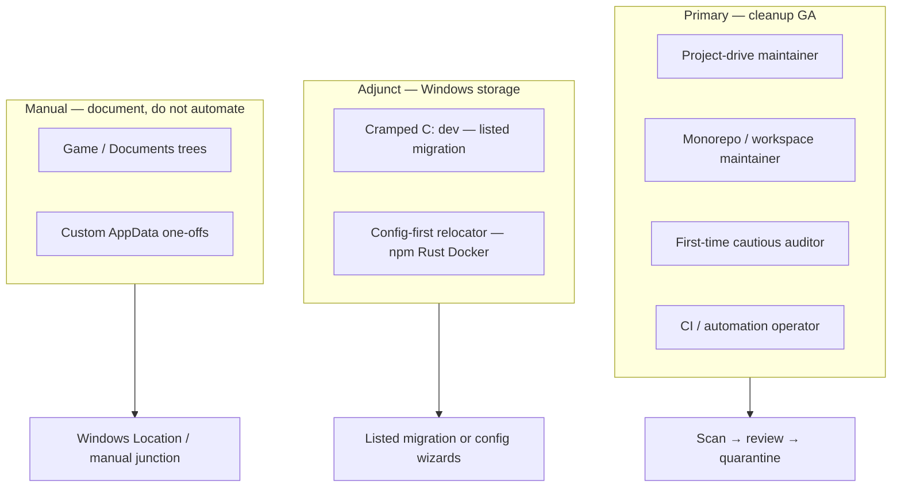
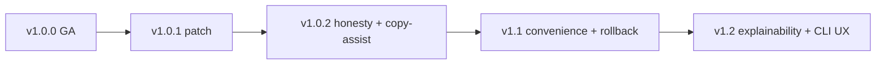

# Post-1.0 direction — convenience, security, and user types

**Status:** Planning (post-`v1.0.0`)  
**Last updated:** 2026-06-11  
**Parent:** [v1.0-roadmap.md](v1.0-roadmap.md) · [capabilities-and-limits.md](capabilities-and-limits.md)

After 1.0 GA, improvements should **deepen trust and reduce friction** without reversing honest limits: Deco is cleanup-first OSS for developers, with **best-effort listed migration** on Windows — not a universal `C:` liberator.

---

## Guiding principles

| Principle | Implication |
|-----------|-------------|
| **Convenience without overpromising** | Shorten paths to value; never hide migration or scan limits behind fewer clicks. |
| **Security = trust** | Wrong-tier deletion and silent data loss are security failures; parity tests and guardrails ship before “smart” features. |
| **Persona-aware defaults** | Profiles and prompts match how the user actually uses the machine — not one-size-fits-all scan roots. |
| **Honest OSS** | Capabilities doc and UI stay aligned; if behavior changes, commitments update in the same release. |

---

## User types and primary jobs

### 1. Project-drive maintainer *(core)*

**Profile:** Active repos on `D:` / `E:` / `G:`; `C:` may be OS-only.  
**Job:** Reclaim tens of GB from `node_modules`, `target`, build dirs on schedule.  
**Pain today:** Must pick correct volumes/roots; otherwise fine.  
**Direction:** Workspace summary, free-space planner, **monorepo_maintainer** profile as default suggestion after first scan.

### 2. Monorepo / workspace maintainer *(core)*

**Profile:** Many packages under one tree; mixed stale projects.  
**Job:** Per-workspace totals; clean safe tier without touching active packages.  
**Pain today:** Flat lists on huge scans; dormancy hints optional.  
**Direction:** Stronger workspace rollups, stale sort, profile-tuned discovery; optional git dormancy opt-in surfaced in planner.

### 3. First-time cautious auditor *(core)*

**Profile:** New to Deco; fears deleting the wrong tree.  
**Job:** Understand what is safe before any delete.  
**Pain today:** Settings surface area; global caches scary.  
**Direction:** **first_scan** profile prominent; onboarding explains quarantine; “why this row is safe” copy; no review-tier in guided first cleanup.

### 4. CI / automation operator *(core — CLI)*

**Profile:** Scripts, agents, scheduled jobs.  
**Job:** Stable JSON, exit codes, policy packs in repos.  
**Pain today:** TS/Rust drift risk; migration not in scan contract.  
**Direction:** Parity fixture growth; `validate-policy` in CI recipes; documented exit-code matrix; scan contract semver discipline.

### 5. Cramped `C:` developer *(adjunct — Windows)*

**Profile:** Small system SSD; dev tools already moved; Chrome/games still on `C:`.  
**Job:** Free `C:` without breaking apps.  
**Pain today:** Scan finds ~0 on `C:`; expects custom migration to “just work.”  
**Direction:** **Context prompts** after low-yield `C:` scan; migration handoff for **listed** tools only; link to capabilities doc; **no** implied custom automation.

### 6. Config-first relocator *(adjunct — v1.1+)*

**Profile:** Willing to set `npm` cache, `CARGO_HOME`, Docker disk, Steam library.  
**Job:** Move data via official paths, not junctions.  
**Pain today:** Scattered docs; no in-app wizard.  
**Direction:** **M5 config-redirect wizards** — copy-paste env steps, verify commands, no junction promises.

### 7. Game / Documents user *(manual)*

**Profile:** The Sims 4–style `Documents` trees; some `%LOCALAPPDATA%` games.  
**Job:** Move tens of GB with generic Windows guides.  
**Pain today:** Confused with AppData migration tools.  
**Direction:** In-app link to Documents Location + manual junction guide; custom folder labeled copy-assist only; **no** roadmap item for “perfect game migration.”

---

## Axis A — Prompt convenience

“Prompt” here means **timely, plain-language guidance at decision points** — confirm dialogs, banners, empty states, profile nudges — not LLM chat.

### A1 — Contextual scan feedback *(high)*

| Trigger | Prompt / action |
|---------|-----------------|
| Scan on `C:` with &lt;100 MB reclaimable | Explain: scan targets **project folders**, not full profile; suggest other volumes or listed migration |
| Custom roots include `%USERPROFILE%` | Strong guardrail + link to safety doc |
| Zero candidates | “No classified artifacts in these roots” + link to adjust roots or profile |
| Large safe total on non-system drive | Celebrate + one-click planner prefill |

**Ship target:** `v1.1` manifest row **U1**.

### A2 — Persona onboarding *(high)*

| Step | Content |
|------|---------|
| First launch (optional) | “Where do your projects live?” → pre-select volumes / suggest `Projects`, `dev` |
| Profile picker | Short labels: First scan / Monorepo / CI agent — match [cleanup profiles](../../apps/frontend/src/lib/cleanup-profiles.ts) |
| Post-first-scan | Suggest profile switch if settings diverge |

**Ship target:** `v1.1` **U2** (lightweight; no forced wizard).

### A3 — Migration prompts *(medium — Windows)*

| Improvement | Notes |
|-------------|-------|
| Handoff banner → pre-fill listed tool + dest hint | Already partial (v0.9.10); refine ordering by bytes on `C:` |
| Plan failure → link to manual guide section | Chrome vs game vs Documents |
| Partial copy success → numbered steps (in repo) | Ship in **v1.0.2** patch train |
| Commitment banner | In repo — capabilities link |

**Ship target:** v1.0.2 polish + v1.1 **M6** rollback helper (guided, not one-click).

### A4 — Quarantine & cleanup prompts *(medium)*

| Improvement | Notes |
|-------------|-------|
| Preview modal: regeneration hint per kind | “Typical recovery: `pnpm install`” |
| Review-tier rows: show opt-in flag that enabled them | Reduces “why is this here?” |
| Purge confirm: retention days visible | Security + convenience |

**Ship target:** `v1.2` **U3**.

### A5 — CLI ergonomics *(medium)*

| Improvement | Notes |
|-------------|-------|
| `deco scan --profile first_scan` parity with desktop | Document in quickstart |
| Machine-readable “no candidates” reason | CI can branch |
| Policy pack apply dry-run | Safer repo onboarding |

**Ship target:** `v1.2` **U4**.

---

## Axis B — Security and trust

Security for Deco means **preventing wrong deletion**, **auditable destructive actions**, and **transparent limits** — not antivirus or encryption.

### B1 — Classification parity *(ongoing, P0)*

| Action | Rationale |
|--------|-----------|
| Expand `tests/fixtures/classification/` | Every new kind + false-positive case |
| CI fails on unexpected drift | Wrong tier = security bug |
| Document acceptable drift in schema audit | [schema-audit.md](../contract/schema-audit.md) |

**Ship target:** Every release; **v1.1** expands fixture count ≥20%.

### B2 — Destructive-path guardrails *(high)*

| Action | Status / target |
|--------|-----------------|
| Toolchain cache warning on custom scan roots | Shipped v0.9.10 |
| Block execute when scan flags ≠ settings | Verify + test |
| Migration: custom = copy-only (no silent junction claim) | In repo → v1.0.2 |
| Hard-delete behind advanced_mode only | Existing — audit UI exposure |

**Ship target:** v1.0.2 + v1.1 audit of execute guards.

### B3 — Migration audit & recovery *(medium — Windows)*

| Action | Notes |
|--------|-------|
| Audit JSON includes `custom_copy_assist`, manual steps | In repo |
| **M6** guided rollback | Quit → `rmdir` junction → restore backup — documented steps in UI |
| **M7** discover existing junctions | Read-only registry; no auto-modify |
| Never delete destination copy on rename failure | In repo |

**Ship target:** v1.1 **M6–M7**.

### B4 — Supply chain & disclosure *(low frequency, high importance)*

| Action | Notes |
|--------|-------|
| Keep **SECURITY.md** + advisory process current | v0.9.11 |
| Release CI artifact checksums in GitHub Release notes | Verify present |
| Dependabot / `pnpm audit` in CI | Non-blocking warn → blocking for critical |

**Ship target:** v1.1 housekeeping manifest row **S1**.

### B5 — Privacy-preserving convenience *(principle)*

Convenience features must **not** require telemetry:

- Local-only scan history for “last roots” suggestions  
- Optional: export/import settings JSON (user-controlled backup)  
- No cloud account, no path upload for “smart” recommendations  

---

## Proposed release train (post-1.0)

| Version | Theme | Key deliverables |
|---------|--------|------------------|
| **v1.0.1** | Custom migration error handling | Shipped |
| **v1.0.2** | **Honesty release** | Custom copy-assist only; capabilities UI; keep dest on failure; positioning docs |
| **v1.1** | **Convenience + trust** | U1 low-yield scan prompts; U2 persona onboarding; M6 rollback helper; M5 npm/pnpm wizard (one tool); parity fixtures ↑ |
| **v1.2** | **Depth** | U3 regeneration hints in preview; U4 CLI profile flags; M5 expand config wizards; workspace planner polish |
| **v1.3+** | Research | Policy-pack marketplace boundary; optional settings export; macOS/Linux “manual guide only” consolidation |

Each version gets a **manifest** before tag ([release process](../distribution/release-process.md)).

---

## Explicit non-goals (unchanged post-1.0)

- Perfect or one-click **custom** / game / bulk `AppData` migration  
- Scanning entire user profile for bulk delete candidates  
- Telemetry or cloud “AI” classification  
- Competing with TreeSize / CCleaner / closed-source disk managers  
- Kernel drivers or persistent redirector shims  
- Promising all future writes go to a new drive without user-maintained redirects  

---

## Success signals (informal)

| Persona | “We got it right” when… |
|---------|-------------------------|
| Project-drive maintainer | Finds 10+ GB on first scan of `E:` without reading docs |
| Cramped `C:` dev | Understands within one session why scan ≠ `C:` fix; finds Chrome listed migration |
| First-time auditor | Completes quarantine cleanup with zero review-tier surprises |
| CI operator | Same JSON shape desktop/CLI; policy validate in pipeline |
| Contributor | Capabilities doc matches UI; parity CI catches tier regression |

---

## Next steps for maintainers

1. **Tag v1.0.2** when copy-assist + capabilities work on `main` is QA’d.  
2. **Draft v1.1 manifest** from rows **U1, U2, M6, M5 (npm only), S1**.  
3. **User research (lightweight):** 3–5 issues labeled `persona:cramped-c` / `persona:monorepo` from real support threads.  
4. Keep [capabilities-and-limits.md](capabilities-and-limits.md) updated in every migration-related release.

---

## Related docs

- [capabilities-and-limits.md](capabilities-and-limits.md) — honesty pledge  
- [positioning.md](positioning.md) — product tiers  
- [safety.md](safety.md) · [SECURITY.md](../../SECURITY.md)  
- [v1.0-roadmap.md](v1.0-roadmap.md) — original 1.0 train  
- [custom-folder-migration-policy.md](custom-folder-migration-policy.md)
