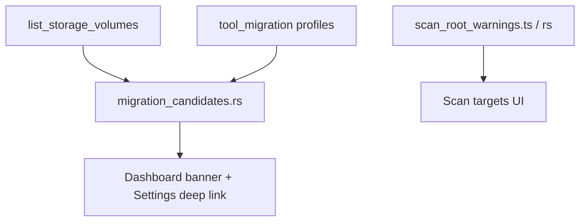

# v0.9.10 manifest — Scan handoff + scan-root guardrails

**Status:** Shipped (`v0.9.10`)  
**Target:** Connect **cleanup pain** on a full OS drive to **Tool storage migration**; reduce toolchain foot-guns from custom scan roots.

Parent: [v1.0-roadmap.md](v1.0-roadmap.md) · Phase F (M4) + trust guardrails.

---

## Goal

1. **M4 — Scan handoff:** When the system volume is low on free space, surface **migration candidates** (known profiles with data on that volume) and link to Settings → Tool storage migration.
2. **H1 — Scan-root guardrails:** Warn when custom scan roots overlap **toolchain / dependency caches** (e.g. `%USERPROFILE%\.cargo`, global npm store) so aggressive cleanup cannot silently corrupt dev tooling.

---

## Scope

| ID | Feature | Notes |
|----|---------|--------|
| **M4a** | OS volume low-space detection | Reuse `list_storage_volumes`; pick system volume (Windows `C:\`, Unix `/` or `$HOME` mount) |
| **M4b** | Migration candidate ranking | For each migratable profile: source exists, not already junction, size estimate optional |
| **M4c** | Dashboard / post-scan banner | Non-blocking; dismissible; i18n en/cn/es |
| **M4d** | Deep link to Settings migration | Open Settings, scroll/focus Tool storage migration; pre-select tool when single clear candidate |
| **M4e** | Threshold setting | Default e.g. &lt;15% free or &lt;20 GB absolute (whichever stricter); stored in Settings |
| **H1a** | Scan-root policy patterns | Denylist/warnlist: `.cargo`, `.rustup`, `AppData\Local\npm-cache`, `AppData\Local\pnpm`, etc. |
| **H1b** | Pre-scan warning UI | Custom scan mode + partition mode when expanded roots hit warnlist |
| **H1c** | Docs | One paragraph in [user-guide.md](../desktop/user-guide.md) + [safety.md](safety.md) |

## Out of scope (v0.9.10)

- Auto-run migration from Dashboard  
- Suggest migration for **custom** folders (profiles only)  
- macOS/Linux migration  
- `SECURITY.md` (v0.9.11)  
- New artifact kinds  

---

## UX sketch

**Low space banner (Dashboard, after scan or on load if volume still low):**

> **C: is 8% free (12 GB).** Cursor and VS Code data on this drive may be ~4.2 GB.  
> [Open Tool storage migration →]

**Scan-root warning (before Start scan):**

> Custom folder `%USERPROFILE%\.cargo` is a **Rust toolchain cache**. Deco is for project artifacts, not global caches — scanning here may classify registry crates as deletable.  
> [Remove from scan] [Scan anyway]

---

## Architecture

- **Backend:** `migration_candidates` (or extend `tool_migration`) — pure functions, unit-tested on Windows; stub empty on non-Windows.
- **Frontend:** banner component; reuse `list_storage_volumes_command` + new `migration_handoff_candidates` command (or embed in existing settings load).
- **Guardrails:** shared path list in Rust + TS (like `migration-path-policy` split).

---

## Acceptance checks

- [ ] With C: below threshold and Cursor Roaming present on C:, banner shows Cursor with link to Settings migration
- [ ] Already-migrated junction → candidate omitted or shown as “complete”
- [ ] Dismiss banner → stays dismissed for session (or until free space changes materially)
- [ ] Adding `%USERPROFILE%\.cargo` as custom scan root → warning before scan
- [x] `pnpm test:rust` + CLI tests green; i18n keys in en/cn/es
- [ ] Manual QA on installed MSI: banner + Settings link works

---

## Related

- [v0.9.4-manifest.md](v0.9.4-manifest.md) — M4 originally scoped v0.9.6+  
- [tool-cache-migration.md](../experiments/tool-cache-migration.md) — open questions on scan vs threshold  
