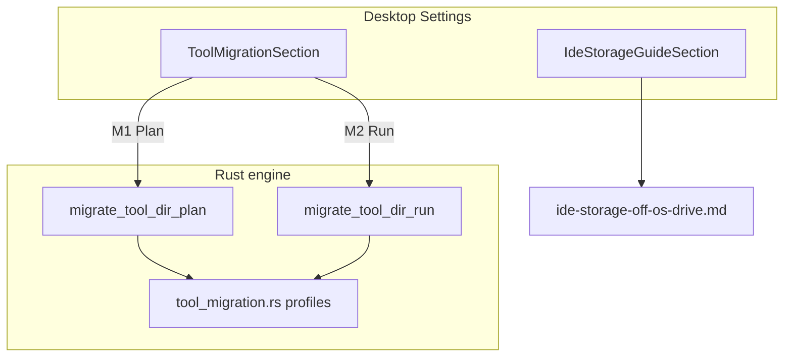

# v0.9.4 manifest — Desktop migration wizard (relaunch)

**Status:** Ready to tag (pending maintainer QA on production installer)  
**Target release:** `v0.9.4`  
**Theme:** Bring **safe, guided** tool-directory migration back to the desktop app after `v0.9.3` removed automated Run from Settings.

Parent: [version-roadmap.md](version-roadmap.md) · Phase F · Follows `v0.9.3` (manual IDE guide only).

**Ship when:** checklist below done, `pnpm check` green, version sources at `0.9.4`, then tag `v0.9.4` after QA on an **installed** build (not dev-only).

---

## Principles (must hold)

1. **Plan before Run** — every user sees paths, size, warnings, and running processes before any destructive step.
2. **Profile-aware** — use the shared catalog in [tool-migration-profiles.md](tool-migration-profiles.md); plan-only tools stay plan-only.
3. **Rollbackable** — backend already copies → backup rename → junction → verify; UI must surface audit log paths and backups.
4. **No registry surgery by default** — junction-at-original-path first; config-redirect tools get guided copy, not auto-edit.
5. **Complement, don't replace** — [ide-storage-off-os-drive.md](../desktop/ide-storage-off-os-drive.md) remains the fallback manual reference.

---

## Phased delivery (within v0.9.4+)

| ID | Slice | User-visible outcome | Target |
|----|-------|----------------------|--------|
| **M1** | Plan UI in Settings | Tool picker, dest root, **Plan** → summary (paths, size, process warnings) | **v0.9.4** — Done |
| **M2** | Run + confirm modal | `ConfirmDialog`, `OperationBusyOverlay`, audit log display | **v0.9.4** — Done |
| **M3** | Managed migrations | SQLite registry of completed migrations; list + rollback entry point | v0.9.5 |
| **M4** | Scan handoff | Low free-space on OS volume → suggest migration candidates from known profiles | v0.9.6+ |
| **M5** | Config-redirect wizards | npm/pnpm/Rust/Go: copy env/config steps, no junction | v0.9.6+ |

---

## Scope checklist — v0.9.4

| ID | Deliverable | Status |
|----|-------------|--------|
| **V1** | Bump release version sources to `0.9.4` | Done |
| **D1** | This manifest + roadmap/status links | Done |
| **U1** | `ToolMigrationSection` — Plan UI calling `migrate_tool_dir_plan` | Done |
| **U2** | Shared TS types (`tool-migration-types.ts`) | Done |
| **U3** | i18n refresh (plan-first copy) | Done |
| **U4** | Manual guide section kept below migration (complement) | Done |
| **U5** | Run + `ConfirmDialog` + `migrate_tool_dir_run` + result/audit display | Done |
| **T1** | Manual QA: Plan + Run Cursor on Windows (junction + history intact) | **Deferred** — run on production installer after tag; cannot QA from inside Cursor dev session |

### Deferred to M3+

| Item | Reason |
|------|--------|
| Managed migrations registry (M3) | SQLite + rollback list |
| macOS/Linux desktop Run | Junction primitive is Windows-only |
| Docker / MSIX run paths | Remain plan-only per profiles doc |

---

## Architecture

- **Frontend:** `ToolMigrationSection` owns migration state; `SettingsPanel` stays thin.
- **Backend:** Reuse `apps/desktop/src-tauri/src/commands/tool_migration.rs` — no engine changes for M1.
- **CLI:** Unchanged; remains the automation/scripting surface.

---

## Manual QA (release gate)

1. Windows, NTFS destination (e.g. `G:\DevToolData`).
2. Settings → **Tool storage migration** → select `cursor`, enter dest root → **Plan**.
3. Confirm Roaming + Local legs, size estimate, no errors when Cursor is quit.
4. With Cursor running, Plan shows `running_processes` warning and Run stays disabled.
5. Quit Cursor → **Run migration** → confirm modal → wait for completion; audit log path shown.
6. Restart Cursor — settings, extensions, chat history intact; original path is a junction.
7. Plan-only profile (`docker-desktop`) shows plan-only message; Run disabled.
8. macOS/Linux: section shows unsupported-platform message.

---

## Non-goals (v0.9.4)

- Managed migrations registry (M3)
- Arbitrary folder picker for source (custom `--source`/`--dest` stays CLI)
- Moving `C:\Windows`, Program Files, or profile root
- One-click migration without reading the plan summary

---

## Related

- [tool-cache-migration.md](../experiments/tool-cache-migration.md) — original spike
- [migrate-tool-dir.md](../cli/migrate-tool-dir.md) — CLI reference
- [tool-migration-profiles.md](tool-migration-profiles.md) — profile catalog
