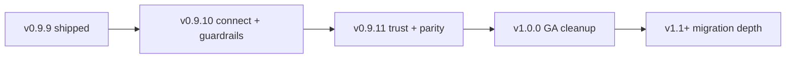

# Roadmap to 1.0 — Deco

**Last updated:** 2026-06-11 · **Latest shipped:** `v1.0.0` · **Next:** [post-v1.0-direction.md](post-v1.0-direction.md) (`v1.0.2` → `v1.1+`)

Actionable plan from the post-`v0.9.9` evaluation: ship **connective tissue** (scan ↔ migration), **trust hardening**, then tag **`1.0.0`** for the core cleanup product. Windows migration stays a **platform-badged** feature, not a 1.0 blocker.

Parent: [version-roadmap.md](version-roadmap.md) · [PROJECT.md](../../PROJECT.md)

---

## Product thesis at 1.0

> **Deco 1.0** — Know what you’re deleting, undo it if you’re wrong, and (on Windows) move tool data off a full OS drive without breaking your setup.

| Axis | 1.0 scope |
|------|-----------|
| **Cleanup** (scan → quarantine → restore) | **GA** — Windows, macOS, Linux |
| **Tool storage migration** | **Shipped, Windows-only** — labeled clearly; not in scan contract |
| **Engine** | Contract-stable JSON; fixture parity TS≈Rust (not necessarily one binary) |

---

## Release train

| Version | Theme | Manifest | Ship when |
|---------|--------|----------|-----------|
| **`v0.9.10`** | M4 scan handoff + toolchain scan-root warnings | [v0.9.10-manifest.md](v0.9.10-manifest.md) | M4 + H1 checklist green |
| **`v0.9.11`** | SECURITY.md, parity fixtures, 1.0 QA prep | [v1.0.0-manifest.md](v1.0.0-manifest.md) § prep | Security + parity rows done |
| **`v1.0.0`** | Official “safe to recommend” cleanup release | [v1.0.0-manifest.md](v1.0.0-manifest.md) | All 1.0 exit criteria checked |
| **`v1.1+`** | Convenience, security, personas — see [post-v1.0-direction.md](post-v1.0-direction.md) | TBD | After v1.0.2 honesty release |

---

## What each release delivers

### v0.9.10 — Connect cleanup to migration

**Problem:** Users hit low **C:** during scan/cleanup but must discover Settings → migration on their own.

**Outcome:**

- When the **OS / system volume** is below a configurable threshold, show a **non-blocking banner** with reclaimable migration candidates (known profiles with data on that volume, not already migrated).
- **Open Settings → Tool storage migration** (pre-select profile when possible).
- **Scan-root guardrails:** warn before scan when custom roots include toolchain caches (`.cargo`, `node_modules` at repo root mis-scoped, etc.) — prevents accidental `.cargo` registry damage.

**Out of scope:** Auto-run migration from scan; macOS/Linux migration.

---

### v0.9.11 — Trust hardening (no user-facing feature splash)

**Problem:** 1.0 requires security disclosure process and fewer TS/Rust classification surprises.

**Outcome:**

- Root **`SECURITY.md`** + GitHub advisory link in README (already referenced in README privacy section).
- Expand **`classification-parity`** fixtures; document “known acceptable drift.”
- **1.0 manual QA script** run on installed builds (Win + one non-Win).
- Optional: scan contract **`schema_version`** freeze note in [changelog.md](../contract/changelog.md).

**Out of scope:** Merging CLI into Rust engine; automated migration rollback.

---

### v1.0.0 — GA cleanup

**Problem:** “Recommend to any developer” bar.

**Outcome:** Tag when [v1.0.0-manifest.md](v1.0.0-manifest.md) exit checklist is complete. Marketing focuses on **cleanup**; migration gets a **Windows** badge in docs and Settings.

**Explicit non-blockers for 1.0:**

- Windows migration on macOS/Linux  
- M4 beyond v0.9.10 banner  
- Yarn / pip / Conda cache kinds (Phase B backlog)  
- Single merged engine  

---

### v1.1+ — Post-1.0 (convenience + security + personas)

Full plan: **[post-v1.0-direction.md](post-v1.0-direction.md)**

| ID | Feature | Notes |
|----|---------|--------|
| **U1** | Low-yield / wrong-root scan prompts | e.g. “scan found little on C: because…” |
| **U2** | Persona onboarding | Project location + profile nudge |
| **M5** | Config-redirect wizards | npm/pnpm/Rust/Go — env steps, no junction |
| **M6** | Guided rollback helper | Quit app → remove junction → restore backup |
| **M7** | Custom junction discovery | Register arbitrary junctions (read-only detect) |
| **M8** | CLI migration registry export | Optional JSON for automation |
| **S1** | Security housekeeping | Parity fixtures, audit CI, checksum notes |

**Explicit non-goals:** perfect custom/game migration; profile-wide scan delete; telemetry-based “smart” cleanup.

---

## Engineering priorities (ongoing)

1. **Contract first** — scan JSON stable; migration commands stay outside schema until explicitly versioned.
2. **Parity tests over big-bang rewrite** — grow `tests/fixtures/` before consolidating engines.
3. **Feature manifests** — one version = one manifest; tag after `pnpm check` + CI green ([release process](../distribution/release-process.md)).
4. **Platform honesty** — migration UI shows “Windows · NTFS” where relevant; unsupported platforms get a single clear message.

---

## Success metrics (informal)

| Milestone | Signal |
|-----------|--------|
| v0.9.10 | User with &lt;10% free on C: sees migration suggestion after scan |
| v0.9.11 | SECURITY.md live; parity test count ↑; no P0 misclassification in fixtures |
| v1.0.0 | Maintainer comfortable recommending cleanup to strangers; three OS installers verified |
| v1.1+ | Your personal migration workflow needs no manual guide for common rollback |

---

## Related docs

- [status.md](status.md) — handoff / next session  
- [v0.9.x manifests](v0.9.9-manifest.md) — migration feature history  
- [safety.md](safety.md) · [scan-contract.md](../contract/scan-contract.md)  
- [tool-cache-migration.md](../experiments/tool-cache-migration.md) — original spike  
