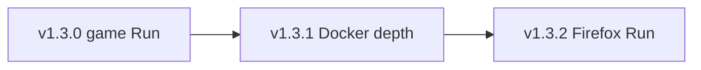

# v1.3 manifest — Profile Run graduation

**Status:** Shipped (`v1.3.0`) — M8–M10 + X1/X4 on one tag; X2 optional hint deferred  
**Theme:** Graduate validated Plan-only migration profiles to Run; deepen Docker guidance without false junction promises.

Parent: [post-v1.0-direction.md](post-v1.0-direction.md) · [capabilities-and-limits.md](capabilities-and-limits.md)

---

## Positioning

**v1.3** extends listed **tool storage migration** for game launchers and clarifies Docker disk layout. Cleanup core and honest migration limits are unchanged: no bulk `AppData` automation, no perfect custom/game relocation.

---

## Exit criteria

### M8 — Game launcher Run (v1.3.0)

| ID | Criterion | Status |
|----|-----------|--------|
| **M8a** | `epic-games`, `steam-appdata`, `battle-net` → `planOnly: false` (TS + Rust + UI) | ☑ |
| **M8b** | Plan includes launcher-specific warnings (not game library paths) | ☑ |
| **M8c** | Process detection QA (`EpicGamesLauncher.exe`, `steam.exe`, `Battle.net.exe`) | ☑ code · ☐ manual QA |
| **M8d** | [tool-migration-profiles.md](tool-migration-profiles.md) + [migrate-tool-dir.md](../cli/migrate-tool-dir.md) updated | ☑ |
| **M8e** | Manual QA: Plan → Run → launch → rollback steps | ☐ |

### M9 — Docker depth (v1.3.1)

| ID | Criterion | Status |
|----|-----------|--------|
| **M9a** | Plan splits size: `LocalAppData\Docker` subtree vs `wsl\data\ext4.vhdx` when present | ☑ |
| **M9b** | Settings Docker config wizard (plan-only; official disk-location checklist) | ☑ |
| **M9c** | Plan warns when VHDX is the dominant byte source | ☑ |
| **M9d** | No VHDX junction Run promise | ☑ |

### M10 — Firefox Run (v1.3.2)

| ID | Criterion | Status |
|----|-----------|--------|
| **M10a** | `firefox` → `planOnly: false` | ☑ |
| **M10b** | Plan validates `profiles.ini` / layout | ☑ |
| **M10c** | Manual QA | ☐ |

### Cross-cutting

| ID | Criterion | Status |
|----|-----------|--------|
| **X1** | Plan errors when destination free space &lt; source size × 1.2 | ☑ |
| **X2** | Suggest dest root on NTFS volume with most free space (optional UI hint) | ☐ |
| **X3** | CHANGELOG + [capabilities-and-limits.md](capabilities-and-limits.md) sync on tag | ☑ |
| **X4** | Cleanup/migration success UX — soft errors must not raise global failure banner | ☑ |

### Release

| ID | Criterion | Status |
|----|-----------|--------|
| **R1** | `pnpm check` green | ☑ |
| **R2** | Version bump on tag | ☑ |

---

## Rollout order

1. **v1.3.0** — Epic Games Launcher pilot, then Steam AppData + Battle.net.
2. **v1.3.1** — Docker分项 Plan + config wizard (not VHDX Run).
3. **v1.3.2** — Firefox Run after layout QA.

---

## Explicit non-goals (v1.3)

- `claude-desktop` Run (MSIX virtualization)
- `npm-cache` / `pnpm-store` junction Run (use config-redirect wizard from v1.1)
- Steam **library** / Epic **install** directory automation
- WSL `ext4.vhdx` automatic migration
- One-click migration rollback (guided steps only, from v1.1)

---

## Manual QA (M8 — per profile)

1. Quit launcher completely (tray + Task Manager).
2. Plan on `C:` → destination on healthy NTFS drive (e.g. `G:\AppData`).
3. Run → confirm source is junction, destination has data.
4. Launch launcher; sign in / open library smoke test.
5. Follow rollback helper steps on a test machine before deleting `.deco-backup-*`.

---

## Related docs

- [tool-migration-profiles.md](tool-migration-profiles.md)
- [custom-folder-migration-policy.md](custom-folder-migration-policy.md)
- [v1.2-manifest.md](v1.2-manifest.md)
