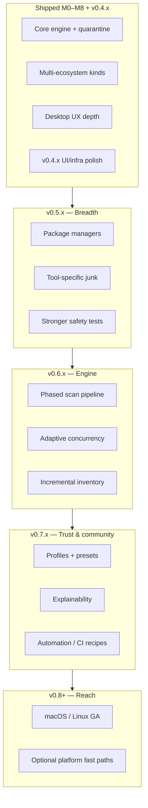

# Version roadmap — Deco

Forward-looking plan for **Deco (Developer Compact)** after milestones **M0–M8** (shipped). This roadmap applies to **all storage types** (HDD, SSD, NVMe): the engine favors **less I/O, smarter phasing, and bounded concurrency** rather than hardware-specific hacks.

For delivery history, see [milestones](../milestones/README.md). For principles and safety, see [PROJECT.md](../../PROJECT.md) and [ROADMAP.md](../../ROADMAP.md).

**Last updated:** 2026-05-19 · **Latest shipped:** `v0.8.1` · **Development head:** `v0.8.2` — [v0.8.x-roadmap.md](v0.8.x-roadmap.md)

**Release model:** One feature set per version, in roadmap order. Desktop installers target **Windows, macOS, and Linux** from **`v0.8.0`** onward (see [v0.8.0-manifest.md](v0.8.0-manifest.md)).

---

## North star (unchanged)

Deco is a **lightweight, safety-first** developer cleanup tool:

- Scan → classify → review → **quarantine-first** cleanup → restore/purge.
- **Explain** every candidate (kind, risk, reason codes, project context).
- **Never** compete as a general file shredder or blind `node_modules` deleter.
- Stay **small at rest** (installer on the order of a few MB; no bundled runtimes for end users).

---

## Versioning policy

| Stream | Meaning | Examples |
|--------|---------|----------|
| **Patch** `0.4.x` | UX polish, client infra, bugfixes; no breaking scan contract | `v0.4.10` Dashboard tabs, history reuse |
| **Minor** `0.5.x` | New artifact kinds, package-manager caches, settings/flags; contract bumps only when documented | `v0.5.0` npm/pnpm cache kinds |
| **Minor** `0.6.x` | Scan engine performance (phased discover/size, incremental index); optional experimental flags | `v0.6.0` adaptive concurrency |
| **Minor** `0.7.x` | Trust, automation, community presets; CLI/desktop parity hardening | Profiles, dormancy hints |
| **Major** `1.0.0` | Stable public API, classification parity TS≈Rust, multi-OS GA | When “safe to recommend blindly” bar is met |

**Scan contract:** bump `schema_version` only with [contract changelog](../contract/changelog.md) + JSON Schema update.

---

## Phase map (overview)

| Phase | Version band | Theme | HDD & SSD |
|-------|--------------|-------|-----------|
| **A** | `v0.4.x` (current) | Desktop UX + client infrastructure | Same UI; custom-folder scan reduces I/O on any disk |
| **B** | `v0.5.x` | Ecosystem & package-manager coverage | Same rules; more **opt-in** global caches |
| **C** | `v0.6.x` | Scan engine efficiency (hardware-agnostic) | Adaptive parallelism; two-phase sizing; optional incremental index |
| **D** | `v0.7.x` | Trust, explainability, community | Presets, dormancy hints, shared policy packs |
| **E** | `v0.8.x+` | Platform reach & optional OS integrations | e.g. Windows inventory APIs behind `experimental` flags |

---

## Phase A — `v0.4.x` · UX & client infrastructure

**Goal:** Make the desktop app fast to understand and hard to misuse, without changing core safety defaults.

| Release | Focus | Status |
|---------|-------|--------|
| `v0.4.7` | Custom scan folders, scan mode UI, HDD-friendly discovery | Shipped |
| `v0.4.8` | History filters, delete/clear history | Shipped |
| `v0.4.9` | Settings refactor, Quarantine filters, Dashboard summary | Shipped |
| `v0.4.10` | Dashboard scan tabs, last-scan card, selection bar, `-.-- B` metrics, history reuse fix | Shipped |
| `v0.4.11` | Shared filter bar, scan progress UX, themed scrollbars + `NumberInput`, keyboard shortcuts, onboarding, planner slider/chart, footer polish | Shipped |

**Exit criteria for 0.4 line:** Dashboard and Settings feel cohesive; no regression in quarantine/history flows; `pnpm check` green on release tags.

---

## Phase B — `v0.5.x` · Ecosystem & package managers

**Goal:** Broaden **developer-specific** reclaim paths while keeping global/tool caches **opt-in** and **review-tier** by default.

### Target additions (prioritized)

| Priority | Kind / area | Notes | Default risk |
|----------|-------------|-------|--------------|
| P0 | **npm** cache (`~/.npm`, `_cacache`) | Document regen (`npm cache clean`) | Review + opt-in |
| P0 | **pnpm** store (`PNPM_HOME`, store path) | Respect `pnpm store path`; never guess delete store root blindly | Review + opt-in |
| P1 | **Yarn** Berry / Classic caches | Version-aware detection | Review + opt-in |
| P1 | **pip** / **uv** caches | User/site cache dirs with markers | Review + opt-in |
| P1 | **Conda** / **Miniconda** / **Anaconda** | `pkgs`, `envs` caches; strong warnings; never touch active `base` without explicit scope | Review / blocked without scope |
| P2 | **Cargo** registry cache | `CARGO_HOME/registry` | Review + opt-in |
| P2 | **Composer**, **NuGet** global caches | .NET already has project `bin/obj`; extend global story | Review + opt-in |
| P2 | **C++** build trees | `cmake-build-*`, `out/`, MSVC-adjacent dirs only with project signals | Safe/review per policy |
| P3 | **Temp / tool junk** | Browser dev profiles, old installer caches — only with explicit patterns | Review |

### Safety gates (every new kind)

Follow [scanning philosophy](../../PROJECT.md#scanning-philosophy-whitelist--layered-rules): **whitelist kind first**, then markers, project context, and opt-in globals — no AI classification.

1. Unit + integration tests in Rust (`scanner` + `classifier` + `path_policy`).
2. Protected paths: **Electron IDE** runtimes, **MSVC/Windows Kits**, **Program Files**, user profile roots.
3. Desktop: preview + quarantine default; CLI: dry-run default.
4. [Scan contract](../contract/scan-contract.md) bump + changelog entry when wire shape changes.

### Suggested releases

| Version | Scope |
|---------|--------|
| `v0.5.0` | npm + pnpm cache discovery, settings flags, docs, review-tier execute guard | Shipped |
| `v0.5.1` | Yarn + pip/uv global caches | Shipped |
| `v0.5.2` | Conda/Miniconda `pkgs` cache, regeneration hints in candidate detail | Done |
| `v0.5.3`–`v0.5.6` | Cargo, bun, NuGet globals; CMake `cmake-build-*` | Shipped |
| `v0.5.7` | Composer global cache, MSVC `Debug`/`Release` trees, community `.deco` policy examples, two-step scan stop, cleanup UX | Shipped |
| `v0.6.0` | Chunked classify+size pipeline, parallel classify + project-root cache, `scan_concurrency_mode`, phase timings, Dashboard-only scan targets | Shipped |
| `v0.6.1` | Incremental path inventory, Quick update scan, `incremental_inventory_enabled` | Shipped |
| `v0.6.2` | `deco-bench`, synthetic baseline, CI regression guard | Shipped |
| `v0.6.3` | Scan strategy presets (`thorough` / `balanced` / `fast` / `background`) | Shipped |
| `v0.6.4` | Scan statistics panel (phase timings, reuse %, kinds) | Shipped |
| `v0.6.5` | Smart discovery, fast delete, HDD cleanup basics, scan progress fix | Shipped |
| `v0.6.6` | Large-scan UX, HDD delete mode, candidate list layout | Shipped |
| `v0.6.7` | Quick-update bench, size phase, batch delete UX | Shipped — [v0.6.7-manifest.md](v0.6.7-manifest.md) |

**Exit criteria:** Each new kind has documented “what breaks if I delete this” text; false-positive tests for Cursor/VS Code/Electron and MSVC paths.

---

## Phase C — `v0.6.x` · Scan engine (all disks)

**Goal:** Faster **perceived** and **wall-clock** scans without GPU dependency. Optimizations must help **both** slow HDDs and fast SSDs (SSD may use slightly higher concurrency caps).

### C1 — Phased pipeline (promote from experiments)

| Stage | Work | User-visible effect |
|-------|------|-------------------|
| Discover | Walk + classify paths; minimal stat | Candidate list appears early |
| Size | Bounded parallel sizing of candidates only | Bytes fill in (`Sizing…` → values) |
| Report | Totals + history persist | Same contract envelope |

CLI already reports `discover → classify → size`; desktop should match semantics end-to-end.

### C2 — Adaptive concurrency (settings: `scan.concurrency_mode`)

| Mode | Behavior |
|------|----------|
| `auto` (default) | Cap parallel size workers from CPU count **and** active volume characteristics |
| `low` | 1–2 workers — friendly to HDD and background use |
| `high` | More workers — useful for NVMe / many roots on different volumes |

**Not** “more threads always faster.”

### C3 — Incremental inventory (experimental → stable)

- SQLite table: `(abs_path, kind, mtime, size, scan_id)`.
- Re-scan: skip unchanged subtrees when mtime/size match.
- User control: “Full rescan” vs “Quick update.”

### C4 — Optional platform fast paths (experimental, non-blocking)

- Windows NTFS change journal / USN-assisted **inventory** (not delete).
- macOS/Linux: no journal dependency; incremental DB still applies.

### Suggested releases

| Version | Scope |
|---------|--------|
| `v0.6.0` | Desktop phased progress parity; adaptive concurrency `auto` |
| `v0.6.1` | Incremental inventory (experimental setting) |
| `v0.6.2` | Benchmark suite + docs for maintainers (`docs/experiments/scan-performance.md`) |
| `v0.6.3` | Scan strategy presets in Settings + dashboard hint |

**Exit criteria:** Measurable improvement on a reference tree (e.g. monorepo + `node_modules` at boundary) without rising blocked-path incidents.

**Explicit non-goals for 0.6:** GPU hashing, content-defined duplicate finding across arbitrary user files.

---

## Phase D — `v0.7.x` · Trust, explainability, community

**Goal:** Help users and contributors **trust** recommendations at scale.

| Theme | Deliverables |
|-------|----------------|
| **Profiles** | “First scan”, “Monorepo maintainer”, “CI agent” — preset roots, depth, opt-in globals |
| **Dormancy ranking** | “Likely stale” vs “touched recently” — explain only, no auto-delete |
| **Regeneration hints** | Per-kind: `pnpm store prune`, `npm cache clean`, `conda clean`, etc. |
| **Policy packs** | Shareable `.deco` snippets in repo or community gallery (validated schema) |
| **Classification parity** | Reduce TS/Rust drift; shared fixture trees in `tests/fixtures/` |
| **Automation** | Documented CI recipe: `deco --json` + exit codes + max reclaim threshold |

| Version | Scope | Status |
|---------|--------|--------|
| `v0.7.0` | Profiles + regeneration hints in UI | Shipped |
| `v0.7.1` | Dormancy signals (mtime + optional git last-commit hook — opt-in) | Shipped |
| `v0.7.2` | Policy pack validation CLI + examples repo | Shipped |
| `v0.7.3` | Classification parity fixtures + CI automation recipe | Shipped |
| `v0.7.4` | Policy pack desktop UX + parity round 1 | Shipped |
| `v0.7.5` | Classification parity round 2 | Shipped |
| `v0.7.6` | Community policy gallery + apply polish | Shipped |
| `v0.7.7` | Cleanup feedback + README demos | Shipped |
| `v0.7.8` | Workspace rollups | Shipped — [v0.7.8-manifest.md](v0.7.8-manifest.md) |

**Phase D exit:** `v0.7.8` tagged and `pnpm check` green.

---

## Phase E — `v0.8.x` · Platform reach

Full sequence: [v0.8.x-roadmap.md](v0.8.x-roadmap.md). One feature set per version:

| Version | Scope | Status |
|---------|--------|--------|
| `v0.8.0` | **Multi-platform installers** — Windows, macOS, Linux + per-OS CLI zips | Shipped — [v0.8.0-manifest.md](v0.8.0-manifest.md) |
| `v0.8.1` | winget + Homebrew | Shipped — [v0.8.1-manifest.md](v0.8.1-manifest.md) |
| `v0.8.2` | Localization phase 1 | Shipped — [v0.8.2-manifest.md](v0.8.2-manifest.md) |
| `v0.8.3` | Localization phase 2 + UX | Shipped — [v0.8.3-manifest.md](v0.8.3-manifest.md) |
| `v0.8.4` | README product demos (GIFs) | Shipped — [v0.8.4-manifest.md](v0.8.4-manifest.md) |
| `v0.8.5` | Windows USN/MFT inventory (experimental) | Planned — [v0.8.5-manifest.md](v0.8.5-manifest.md) |

| Item | Version | Notes |
|------|---------|--------|
| **Plugin boundary (research)** | Pre-`1.0.0` | Research doc only; not a product ship in 0.8.x |
| **SECURITY.md** | Pre-`1.0.0` | Required before [1.0.0 criteria](#phase-e--v08x--platform-reach) below |

**1.0.0 criteria (draft):**

- Windows + at least one additional OS GA.
- Scan contract stable for ≥2 minor versions.
- Rust engine is source of truth for classification; CLI uses contract tests against fixtures.
- Security review checklist for destructive paths published.

---

## Experimental track

Spikes live in `docs/experiments/` (create per spike). Promote into a version only when:

- [ ] Feature-flagged or setting-gated
- [ ] Documented rollback to legacy walk path
- [ ] `pnpm check` + benchmark note attached

| Experiment | Target phase | Promotion signal |
|------------|--------------|------------------|
| Two-phase discover → size | C (`v0.6.0`) | Stable UI on 10k+ candidate trees |
| Adaptive concurrency | C (`v0.6.0`) | No regression on HDD reference run |
| Incremental inventory | C (`v0.6.1`) | Rescan &lt;30% wall time on unchanged tree |
| Windows USN/MFT inventory | C/E | Correctness on NTFS only; clear fallback |
| Dormancy ranking | D (`v0.7.1`) | Shipped |
| Workspace rollups | D (`v0.7.8`) | Monorepo summary without double-count |
| Windows USN/MFT inventory | E (`v0.8.5`) | NTFS-only; clear fallback |
| GPU content hashing | — | **Deprioritized** — poor fit for I/O-bound cleanup |

---

## Lightweight product constraints

| Constraint | Target |
|------------|--------|
| Desktop installer (Windows) | Stay single-digit MB where possible |
| Runtime deps | No bundled Node for desktop; CLI zip documents Node 20+ requirement |
| Background work | Scans cancellable; no silent permanent delete |
| Memory | Stream candidates; avoid loading full tree into RAM |

---

## Security & open-source community

| Area | Plan |
|------|------|
| **Safe defaults** | Quarantine-first; blocked system/IDE paths; review globals |
| **Transparency** | Reason codes on every row; linked docs per `kind` |
| **Contributing** | Kind additions require tests + policy doc |
| **Reporting** | SECURITY.md disclosure process (add before `1.0.0`) |
| **Releases** | Signed tags; GitHub Actions artifacts; changelog per version |

---

## How to use this doc

- **Maintainers:** Pick the next patch/minor from the current phase; update [status.md](status.md) and `CHANGELOG.md` when shipping.
- **Contributors:** Open issues labeled `v0.5.x`, `v0.6.x`, etc., referencing a row in the tables above.
- **Users:** Expect **0.5** for more caches; **0.6** for faster rescans; **0.7** for smarter explanations — not GPU acceleration.

---

## Related links

- [ROADMAP.md](../../ROADMAP.md) — M0–M8 archive + experimental one-liners
- [Features](features.md) — current capability list
- [Safety model](safety.md)
- [Scan contract](../contract/scan-contract.md)
